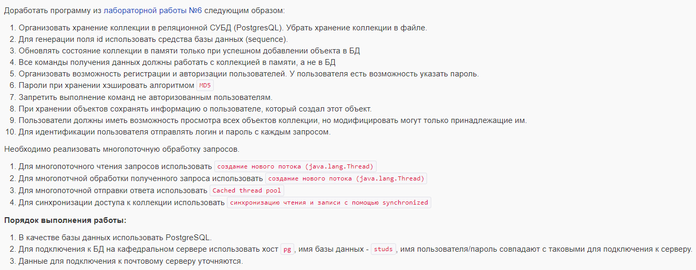

# labs-nkirienko_rkhuzin, v. 12675 (for 7th)

#### Доработать программу из лабораторной работы №6 следующим образом:

- Организовать хранение коллекции в реляционной СУБД (PostgresQL). Убрать хранение коллекции в файле.
- Для генерации поля id использовать средства базы данных (sequence).
- Обновлять состояние коллекции в памяти только при успешном добавлении объекта в БД
- Все команды получения данных должны работать с коллекцией в памяти, а не в БД
- Организовать возможность регистрации и авторизации пользователей. У пользователя есть возможность указать пароль.
- Пароли при хранении хэшировать алгоритмом __MD5__
- Запретить выполнение команд не авторизованным пользователям.
- При хранении объектов сохранять информацию о пользователе, который создал этот объект.
- Пользователи должны иметь возможность просмотра всех объектов коллекции, но модифицировать могут только принадлежащие им.
- Для идентификации пользователя отправлять логин и пароль с каждым запросом.

#### Необходимо реализовать многопоточную обработку запросов.

- Для многопоточного чтения запросов использовать __создание нового потока (java.lang.Thread)__
- Для многопотчной обработки полученного запроса использовать __создание нового потока (java.lang.Thread)__
- Для многопоточной отправки ответа использовать __Cached thread pool__
- Для синхронизации доступа к коллекции использовать __синхронизацию чтения и записи с помощью synchronized__

#### Порядок выполнения работы:

- В качестве базы данных использовать PostgreSQL.
- Для подключения к БД на кафедральном сервере использовать хост pg, имя базы данных - studs, 
  имя пользователя/пароль совпадают с таковыми для подключения к серверу. 
- Данные для подключения к почтовому серверу уточняются.